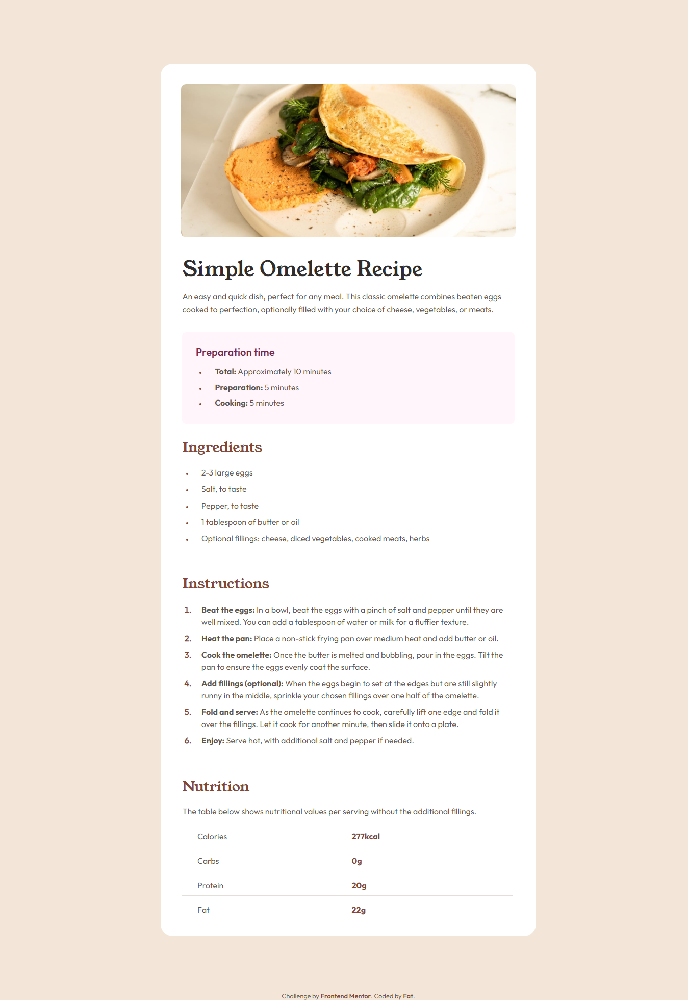

# Frontend Mentor - Recipe page solution

This is a solution to the [Recipe page challenge on Frontend Mentor](https://www.frontendmentor.io/challenges/recipe-page-KiTsR8QQKm). Frontend Mentor challenges help you improve your coding skills by building realistic projects.

## Table of contents

- [Overview](#overview)
  - [The challenge](#the-challenge)
  - [Screenshot](#screenshot)
  - [Links](#links)
- [My process](#my-process)
  - [Built with](#built-with)
  - [Useful resources](#useful-resources)
- [Author](#author)

## Overview

### Screenshot

### Links

- Solution URL: [Repo](https://github.com/Fahatmah/frontendmentor-solutions/tree/main/recipe-page)
- Live Site URL: [Live View](https://fahatmah.github.io/frontendmentor-solutions/recipe-page)

## My process

### Built with

- Semantic HTML5 markup
- CSS custom properties
- Flexbox
- CSS Grid
- Mobile-first workflow

### Useful resources

- [Marker Explained by Kevin Powell](https://www.youtube.com/watch?v=svhnI9sKUDI) - You can customize your list type.

- [Pixel Perfect Pro](https://chromewebstore.google.com/detail/nnhifpoojdlddpnhjbhiagddgckpmpfb) - I only use this on long pages.

## Author

- Frontend Mentor - [@Fahatmah](https://www.frontendmentor.io/profile/Fahatmah)
